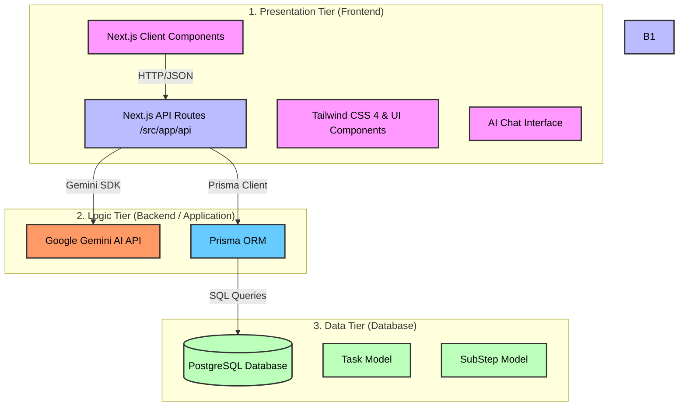
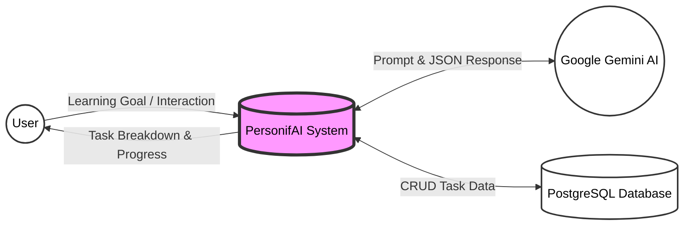
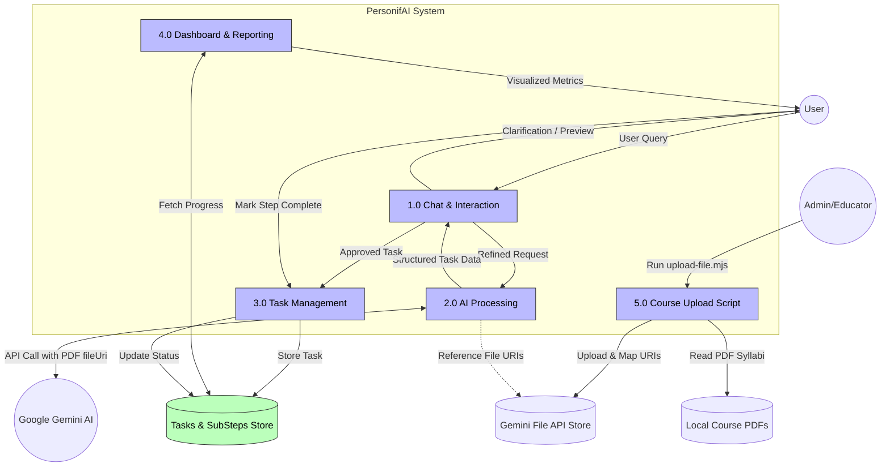
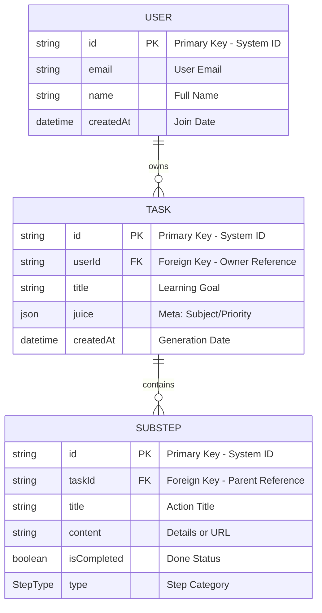

# PersonifAI - System Architecture

This document outlines the Three-Tier Architecture of the PersonifAI platform.

---

## 1. High-Level Architecture Diagram

---

## 2. Data Flow Diagrams (DFD)

### 2.1 Level 0: System Context Diagram
The Level 0 DFD shows the system as a single process interacting with external entities.

### 2.2 Level 1: Internal Module Data Flow
The Level 1 DFD breaks down the system into its core functional modules, showcasing the dynamic retrieval of course material via Gemini's File API.

---

## 3. Entity-Relationship Diagram (ERD)

The following diagram illustrates the relationship between the core entities, including the planned **User** entity for future implementation.

---

## 4. Tier Breakdown

### 4.1 Presentation Tier (Frontend)
The user interface is built using **Next.js (App Router)** and **TypeScript**, ensuring a type-safe and performant experience.
- **UI Framework:** React with functional components.
- **Styling:** Tailwind CSS 4 for a modern, responsive design with dark mode support.
- **Core Interfaces:** 
    - **Landing Page:** Marketing site with conversion-focused sections.
    - **AI Assistant:** Interactive chat interface for task decomposition.
    - **Dashboard:** Management hub for tracking learning progress.

### 4.2 Logic Tier (Application)
The logic tier handles request routing, business logic, and external API orchestrations.
- **API Framework:** Next.js Route Handlers (Server-side).
- **AI Integration:** 
    - Integration with **Google Gemini AI** (`gemini-2.5-flash`).
    - **Context-Grounded Learning (Gemini File API):** Local course PDF study guides (`/Cources`) are uploaded to the Gemini File API using the helper script `upload-file.mjs`. When a user requests help with a task, the API route handler (`src/app/api/chat/route.ts`) maps the message context to the corresponding uploaded PDF URI and attaches it to the generation request.
    - Specialized system prompting to convert natural language and file context into structured JSON task previews with robust YouTube video URL extractors.
- **ORM:** **Prisma 7** manages the database abstraction, using driver adapters for serverless database compatibility.

### 4.3 Data Tier (Database)
Persistent storage for all user data and generated tasks.
- **Database:** **PostgreSQL (Neon Serverless)**.
- **Database Connection:** Leverages `@prisma/adapter-pg` with a serverless `pg` Connection Pool for high-performance query execution and reliable connection pooling.
- **Data Model:**
    - **Task:** Represents a broad learning goal. Includes a flexible `juice` JSON field for metadata (subject, priority).
    - **SubStep:** Actionable items linked to a task (text instructions, video URLs, or revision notes) supporting custom step categories: `TEXT`, `VIDEO`, `PHYSICAL`, and `REVISION`.
